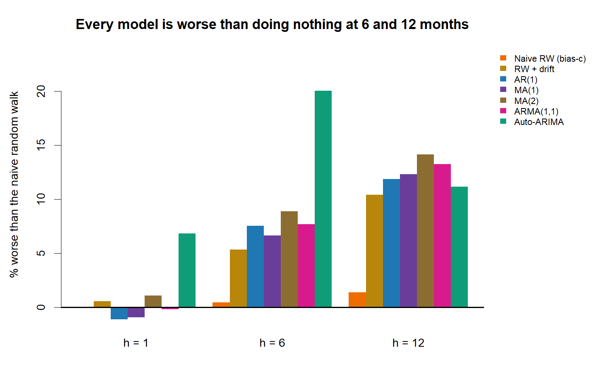
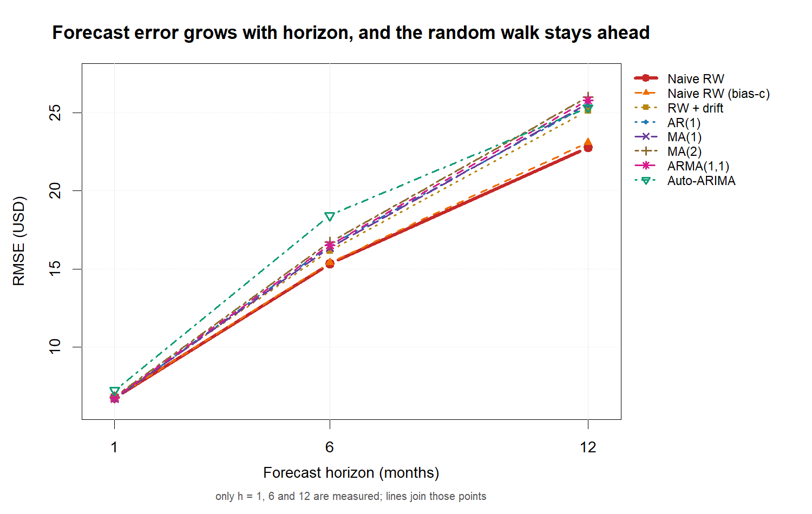
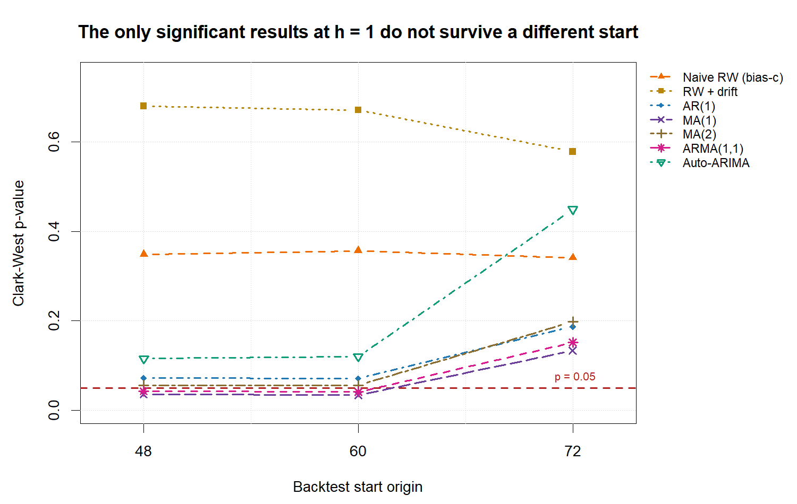

# Brent Crude: does ARIMA beat a random walk?

**No. On monthly Brent crude prices, no ARIMA specification forecasts better than
assuming next month's price equals this month's.** At six and twelve months the
naive random walk is the most accurate forecast tested, in every backtest
configuration. At one month the ranking is unstable and no model is
statistically distinguishable from the random walk.

That includes the auto-selected ARIMA(2,1,0)(0,0,1)[12] which won a single
hold-out comparison in the original coursework — over 74 rolling origins it is
the *worst* of the eight methods at one and six months.



---

## What this repository is

A university time series project, and then a proper evaluation of it.

The original analysis (`submission/`, tagged
[`v1.0-submission`](../../releases/tag/v1.0-submission)) was submitted for Time
Series Analysis and Classification at ENSIA and graded **7.5/10, among the
highest marks in the cohort**. It builds AR, MA and ARMA estimators from
scratch, identifies models with hand-written ACF and PACF, runs residual
diagnostics, and compares five models on a 14-month hold-out set.

It also contains the flaw that motivates everything else here: **the models are
only ever compared against each other.** For a price series that its own
Augmented Dickey-Fuller test shows to be I(1), the benchmark that matters is a
random walk — and without it, "auto-ARIMA wins with 17% MAPE" says nothing about
whether any model has forecasting skill at all.

The submitted notebook is preserved unmodified. Everything in `R/` is the
follow-up: random-walk baselines, a rolling-origin backtest, significance tests
appropriate to nested models, and a check that the conclusions do not depend on
arbitrary choices.

## Method

**Data.** 135 monthly Brent closing prices, January 2015 to March 2026, from
Yahoo Finance (`BZ=F`). Modelled as log-returns after a log transform and one
difference.

**Models.** Eight, all fitted from scratch except the benchmark ARIMA:

| | |
|---|---|
| Baselines | naive random walk, random walk with drift |
| From scratch | AR(1) by Yule-Walker; MA(1), MA(2), ARMA(1,1) by conditional sum of squares |
| Reference | `forecast::auto.arima` |

**Backtest.** Expanding window, 74 origins. Every model is refit at every origin
and forecasts 1, 6 and 12 months ahead. Forecasts are converted from log-returns
back to USD with the lognormal bias correction. The naive benchmark is reported
both with and without that correction, since the choice is a convention rather
than a fact.

**Significance.** Diebold-Mariano with a HAC variance truncated at h−1, because
overlapping multi-step forecasts are autocorrelated by construction, plus the
Harvey-Leybourne-Newbold small-sample correction. Implemented from scratch and
verified against `forecast::dm.test` to nine decimal places.

Because a random walk is AR(1) with φ = 0, the comparisons are **nested**, which
makes Diebold-Mariano undersized. Clark-West is implemented alongside it as the
appropriate test for that case, and both are reported.

**Sensitivity.** The whole backtest is re-run from start origins 48 and 72. A
ranking that depends on where the backtest begins is not a finding.

## Results

### Forecast accuracy

| Model | h=1 RMSE | h=6 RMSE | h=12 RMSE | vs naive @ h=6 | vs naive @ h=12 |
|---|---|---|---|---|---|
| **Naive RW** | 6.77 | 15.35 | 22.77 | - | - |
| Naive RW (bias-c) | 6.77 | 15.42 | 23.09 | +0.4% | +1.4% |
| RW + drift | 6.81 | 16.17 | 25.15 | +5.4% | +10.4% |
| MA(1) | 6.71 | 16.37 | 25.58 | +6.6% | +12.3% |
| AR(1) | 6.70 | 16.50 | 25.47 | +7.5% | +11.9% |
| ARMA(1,1) | 6.76 | 16.53 | 25.79 | +7.7% | +13.2% |
| MA(2) | 6.84 | 16.71 | 26.00 | +8.9% | +14.2% |
| Auto-ARIMA | 7.23 | 18.43 | 25.32 | +20.1% | +11.2% |

74 origins at h=1, 69 at h=6, 63 at h=12. Zero fit failures.



### Significance

**All 21 model-horizon comparisons are statistically indistinguishable from the
naive random walk under Diebold-Mariano.** The largest test statistic anywhere
in the table is 1.53.

Clark-West, the test appropriate for nested models, finds weak evidence at one
month for MA(1) (p = 0.034) and ARMA(1,1) (p = 0.041). Two considerations argue
against reading those as skill: they are two hits out of 21 tests, which is
roughly what chance produces at the 5% level, and the effect is about 1% of
RMSE. The sensitivity analysis settles it.

### Sensitivity

| Model | h=6 rank @48 | @60 | @72 | h=1 CW p @48 | @60 | @72 |
|---|---|---|---|---|---|---|
| **Naive RW** | 1 | 1 | 1 | - | - | - |
| Naive RW (bias-c) | 2 | 2 | 2 | 0.349 | 0.357 | 0.341 |
| RW + drift | 3 | 3 | 3 | 0.680 | 0.671 | 0.578 |
| MA(1) | 4 | 4 | 4 | 0.036 | 0.034 | **0.133** |
| AR(1) | 5 | 5 | 5 | 0.072 | 0.071 | 0.187 |
| ARMA(1,1) | 6 | 6 | 6 | 0.043 | 0.041 | **0.152** |
| MA(2) | 7 | 7 | 7 | 0.056 | 0.056 | 0.198 |
| Auto-ARIMA | 8 | 8 | 8 | 0.116 | 0.120 | 0.449 |

At six months, all eight methods hold the **identical rank order across all
three backtests**. The naive random walk ranks first at six and twelve months at
every start.

At one month nothing is stable. Rank correlations between starts are +0.93,
+0.57 and +0.36, and the two significant Clark-West results disappear when the
backtest starts twelve months later. **No model is significant at all three
starts.**



## Limitations

- **135 observations.** Monthly data over eleven years is a small sample for
  distinguishing forecasting methods, and it bounds how much any of this can settle.
- **One commodity, one source.** Nothing here shows the result generalises
  beyond Brent, or beyond monthly frequency.
- **Linear models only.** The submitted analysis found strong volatility
  clustering and non-normal residuals. A GARCH family model would target that
  directly; none is fitted here, so nothing in this repository speaks to
  volatility forecasting, only to the conditional mean.
- **The h=12 results rest on 63 origins** and overlap heavily, so they carry less
  weight than the h=1 and h=6 numbers.
- **A negative result is not proof of absence.** This shows these models on this
  series do not beat a random walk. It does not show no model could.

## Reproducing

Requires R (developed on 4.6.1) and two packages:

```r
install.packages(c("tseries", "forecast"))
```

On Windows the R installer does not add `Rscript` to `PATH`; either add
`C:\Program Files\R\R-4.6.1\bin\x64` or call `Rscript.exe` by full path.

```sh
Rscript R/verify_extraction.R    # estimators reproduce the graded coefficients
Rscript R/verify_baselines.R     # baselines behave correctly
Rscript R/backtest.R             # the backtest; about 30 minutes
Rscript R/verify_backtest.R      # origin counts and forecast alignment
Rscript R/run_significance.R     # Diebold-Mariano and Clark-West
Rscript R/sensitivity.R          # comparison across start origins
Rscript R/figures.R              # charts
```

`R/backtest.R` and the scripts that read it take an optional start origin, e.g.
`Rscript R/backtest.R 48`. Runtime is dominated by `auto.arima` refitting with
`stepwise = FALSE` at every origin.

Every script that begins with `verify_` exits non-zero on failure, so they work
as regression checks.

## Layout

```
submission/     the graded notebook, unmodified (tag v1.0-submission)
data/           135 monthly Brent closing prices
R/              estimators, baselines, backtest, significance tests, figures
results/        backtest output and test results, one row per origin
figures/        charts used above
```
